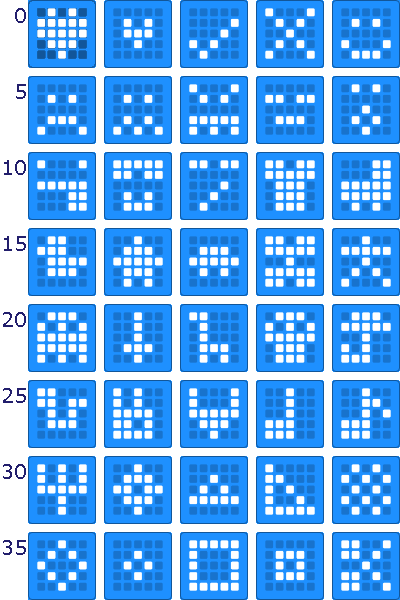

# 拡張機能について

## 内蔵デバイスの利用機能
- 内蔵センサー : `readSensor()`
   - 3軸磁気センサ
   - 3軸加速度センサ
   - 温度
   - 明るさ
- ボタン : `readSensor()`
   - ボタンA
   - ボタンB
- マトリクスLED : `printLED()` および `showIconLED()`

[サンプル](../examples#内蔵デバイス)

### GPIOの拡張機能
- アナログ入出力 : `export ("analogin")`, `export ("analogout")`
- プルアップ/プルダウン設定 : `export ("in","up")`, `export ("in","down")`, `export ("in","none")`
   - `in`のデフォルトは`up`としています

[サンプル](../examples#拡張gpio)

## IDL

```webidl
partial interface Window {
    MicroBitBleFactory microBitBleFactory;
};

interface MicroBitBleFactory {
    Promise<MicroBitBle> connect();
};

interface MicroBitBle {
    Promise<GPIOAccess> requestGPIOAccess ();
    Promise<I2CAccess> requestI2CAccess ();
    Promise disconnect ();
    attribute readonly boolean connected;
    Promise<MicroBitSensData> readSensor ();
    Promise printLED (DOMString message);
    Promise showIconLED (int iconNumber);
};

interface MicroBitSensData{
    attribute readonly VectorValue acceleration;
    attribute readonly VectorValue magneticField;
    attribute readonly int temperature;
    attribute readonly int brightness;
    attribute readonly int button;
};

interface VectorValue{
   attribute int x;
   attribute int y;
   attribute int z;
};

partial interface GPIOPort : EventTarget {
    Promise  export (DirectionMode direction , optional PullMode pullMode);
};

enum DirectionMode { "", "in", "out", "analogin", "analogout" }
enum PullMode { "none", "up", "down" }

partial interface I2CSlaveDevice {
    Promise<Int8Array>  readBytes(unsigned short byteLength);
    Promise  writeByte(octet byte);
    Promise  writeBytes(Int8Array bytes);
};
```

### IconNumber


