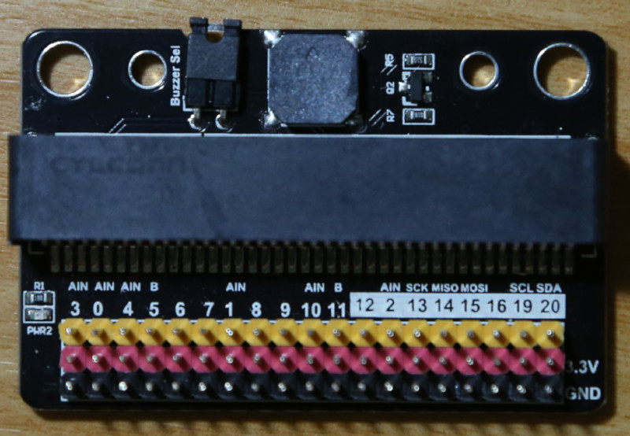
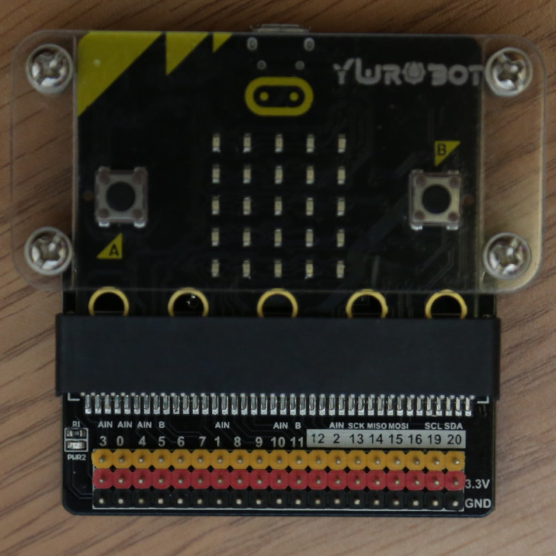

# スタートアップガイド
 
## 概要

CHIRIMEN with micro:bitをはじめてつかうときの流れを解説します。

## 準備するもの

- Bluetooth (4.0 以上) 対応コンピュータ ＋ Web Bluetooth API をサポートする (Blink エンジン採用) ブラウザ
   - Windows10/macOS/Linux PC: [Chrome](https://www.google.com/intl/ja/chrome/), [Chromium](https://www.chromium.org/getting-involved/download-chromium), [Egde (Dev リリース)](https://www.microsoftedgeinsider.com), [Brave](https://brave.com/ja/) などのブラウザ
   - Android スマートフォン/タブレット： [Chrome](https://play.google.com/store/apps/details?id=com.android.chrome), [VideoMark Browser](https://play.google.com/store/apps/details?id=org.webdino.videomarkbrowser) などのブラウザ
   - Raspberry Pi などのシングルボードコンピュータ: Raspbian や ([Chirimen for Raspberry Pi3](https://tutorial.chirimen.org/raspi3/ja/sdcard) で Chromium ブラウザ
   - *Note: Bluetooth が載っていない PC でも Bluetooth USB ドングルで使えるものがあります。(Windows10 PC+エレコムLBT-UAN05C2など)*
- micro:bit ([秋月電子通商](http://akizukidenshi.com/catalog/g/gM-12513/), [Switch Science](https://www.switch-science.com/catalog/5263/), [Amazon](https://www.amazon.co.jp/dp/B07L2KXWGH/) などで購入可能です。2000円程)
- microUSB ケーブル (PC と micro:bit を繋いでサポートプログラムを書き込んだり、micro:bitの電源用に必要)
- micro:bit 用ブレークアウトボード （micro:bitのエッジコネクタをピンヘッダに変換するパーツ。いろいろ種類があります。数百円～）
   - [IoBit (Amazon)](https://www.amazon.co.jp/gp/product/B07TXBXJ4X/), [IoBit (Amazon)](https://www.amazon.co.jp/dp/B07QGZ3DKK)
   - [kitronik (秋月電子)](http://akizukidenshi.com/catalog/g/gP-12836/), [kitronik (Switch Science)](https://www.switch-science.com/catalog/3181/)
   - [keystudio (Amazon)](https://www.amazon.co.jp/dp/B0787DHG2M), [keystudio (Amazon)](https://www.amazon.co.jp/dp/B07GTQ21ST)
- 試したい例に応じたジャンパー線、パーツなど
   - CHIRIMEN スターターキットを使うと、GPIO 入出力と、I2C 温度センサ (ADT7410)の例が試せます

### L チカに必要となるパーツ

- ブレッドボード × 1
- リード付き LED × 1
- リード付き抵抗器 (150Ω-1KΩ) x 1 (赤色LEDは大きい抵抗値でも点灯します)
- ジャンパーワイヤー (オス-メス) x 2

## micro:bitのピンのことを知る

micro:bitにはGPIO等の端子が備わっていますが、ブレッドボードを接続するのに便利なピンヘッダではなく、少し独特な[エッジコネクタ](https://ja.wikipedia.org/wiki/%E3%82%A8%E3%83%83%E3%82%B8%E3%83%BB%E3%82%B3%E3%83%8D%E3%82%AF%E3%82%BF)になっています。GPIO0～2と、GND及び3Vは大きな端子になっていて、ワニ口クリップなどで簡単にLEDなどをつなぐことができますが、CHIRIMEN with micro:bitではこれ(GPIO端子)に加えて、I2C端子(SCL,SDA)を使った例が多いです。これらはとても細い端子(下図の19番(SCL)と20番の端子(SDA))なので、先述のブレークアウトボードが便利です。

### micro:bitのピン配置

 
オリジナルページ：[https://makecode.microbit.org/device/pins](https://makecode.microbit.org/device/pins)

### ブレークアウトボードの使い方

ブレークアウトボードにはmicro:bitのすべての端子にアクセスできるピンヘッダが付けられています。脇には端子の名称も印刷されています。


micro:bitのエッジコネクタをブレークアウトボードに差し込みます。


Examplesや以降の解説の実体配線図では、ブレークアウトボードは省略されています。GPIO番号やSCL,SDA,GND,3V(3.3V,VDD)などの端子の名称をもとにつないでください。

## mircro:bit に CHIRIMEN サポートプログラムを書き込む

CHIRIMEN with micro:bit では WebGPIO/WebI2C API を後述の Polyfill ライブラリと合わせて利用することでアプリケーションを開発します。各 API を呼び出すとライブラリ内では Web Bluetooth API を用いて micro:bit と通信しますが、micro:bit 側には PC からの制御命令を受け取るため専用の <a href="link2original.html#https://makecode.microbit.org/_0jhPcA3iX0gC" target="_blank">CHIRIMEN サポートプログラム</a> を書き込んでおく必要があります。

- <a href="link2original.html#https://makecode.microbit.org/_0jhPcA3iX0gC" target="_blank">こちらのページ</a>にアクセスして、micro:bitにサポートプログラムを書き込みます。<br>
*書き込み方は通常のmicro:bit用プログラムと全く同じです。*
   - [編集]ボタンを押す
   - [ダウンロード]ボタンを押し、サポートプログラムをダウンロード
   - micro:bitをUSBでPCに接続 (USBドライブとしてPC上にマウント)
   - ダウンロードしたプログラムをマウントしたmicro:bit USBドライブにコピー
   - 自動的に再起動しインストール完了。　♡がmicro:bitに表示されます
   - これで準備完了です！ USBケーブルを外して次に進みましょう。(micro:bitのプログラムは電源を落としても消えません)

*なお、このCHIRIMEN用のサポートプログラムは、micro:bit上で動かす他のプログラムと同じ動作環境(makecode)で構築してありますので、CHIRIMEN with micro:bitを使わないときは、特別な手順は必要なく自由に他のプログラムと置き換えることができます。*

### ブラウザの設定を確認

コンピュータと micro:bit との無線通信に利用する Web Bluetooth API はまだ実験的な実装という扱いであり、ブラウザや環境によっては有効化されていません。Chrome などのブラウザで `chrome://flags` ページを開き `Experimental Web Platform features` が有効になっていることを確認、無効の場合は有効化してからブラウザを再起動 (環境によっては設定変更後に一度 Bluetooth のオンオフも) してください。開発者ツールのコンソールで `navigator.bluetooth` オブジェクトが見えるようになっていれば有効化されています。

## LEDを点滅させてみる
- 以下の実体配線図のように配線しましょう。*(ブレークアウトボードは省略しています)*

- micro:bitにUSBケーブルをつなぎ、電源を供給します。(PCのUSBポートからも電源供給可能) ♡がmicro:bitに表示されます
- <a href="../examples/GPIO1.html" target="_blank">こちらのページ</a>にアクセス
- [Connect]ボタンを押して、micro:bitとペアリングします　ペアリングが成功すると◇マークがmicro:bitに表示されます
- LEDが点滅します


### プログラムの解説
- [ソースコードはこちら](https://github.com/chirimen-oh/chirimen-micro-bit/blob/master/examples/GPIO1.html)
- ```<script type="text/javascript" src="https://chirimen.org/chirimen-micro-bit/polyfill/microBitBLE.js"></script>``` でCHIRIMEN with micro:bit用のWebGPIO, WebI2C APIの[ポリフィル](https://developer.mozilla.org/ja/docs/Glossary/Polyfill)ライブラリをロードしています。
- ```microBitBle = await microBitBleFactory.connect();``` でmicro:bitにBluetooth接続します。
- 以下でmicro:bitのGPIO-0番端子を出力に設定して初期化します。この端子は```gpioPort0```という変数でアクセスできるようになります。
```javascript
var gpioAccess = await microBitBle.requestGPIOAccess();
var mbGpioPorts = gpioAccess.ports;
gpioPort0 = mbGpioPorts.get(0);
await gpioPort0.export("out"); //port0 out
```
- ``` await gpioPort0.write(gpio0Val);```　でGPIO-0の出力のHigh(点灯) / Low(消灯)を指定します。

## 次にやること
[こちらのExamples](../examples/)を試してみましょう。
