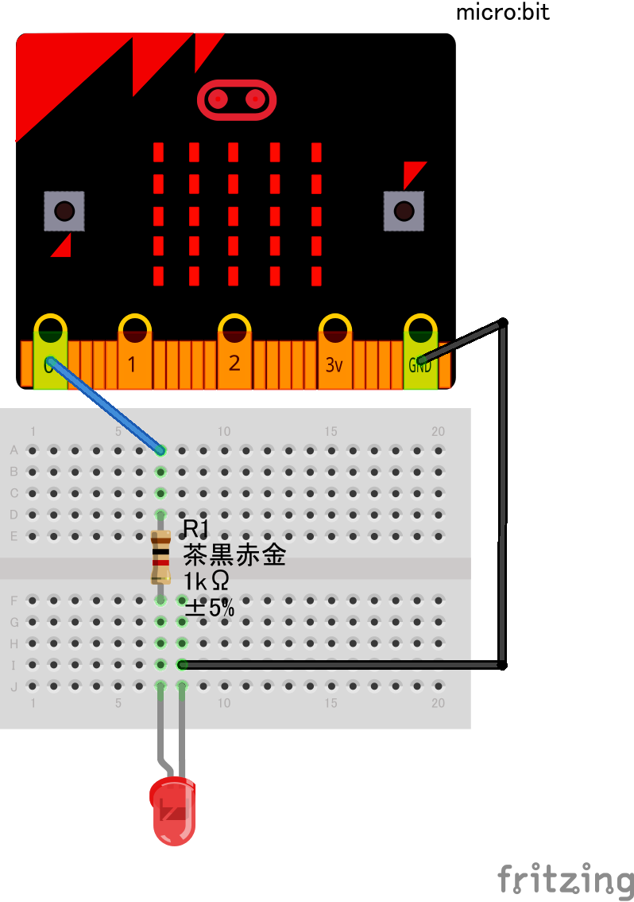
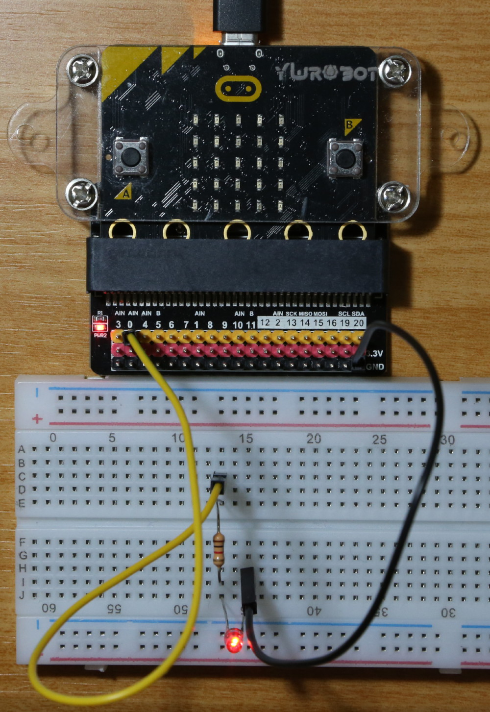

# スタートアップガイド
 
## 概要
CHIRIMEN with micro:bitをはじめてつかうときの流れを解説します。

## 準備するもの
- Bluetooth (4.0以上) が載ったコンピュータ ＋ Web Bluetooth APIをサポートしたブラウザ（以下のいずれか）
   - ( Windows10 PC ｜ MacOS PC ｜ Linux PC ) ＋ ( [Chrome](https://www.google.com/intl/ja/chrome/) ｜ [Chromium](https://www.chromium.org/getting-involved/download-chromium) ｜ [blinkエンジン版次期Edge(Devリリース)](https://www.microsoftedgeinsider.com) )
   - Raspberry Pi3 + Chromium ([Chirimen for Raspberry Pi3](https://tutorial.chirimen.org/raspi3/ja/sdcard)は、CHIRIMEN with micro:bit用としても使える環境設定済みのOSイメージになっています。raspbianで自分で設定して使うこともできます)
   - *Note: Bluetoothが載っていないPCでもBluetooth USBドングルで使えるものがあります。(Windows10マシン+エレコムLBT-UAN05C2など)*
- micro:bit (amazonや秋月電子通商などで購入可能です。2000円程)
- microUSBケーブル(PCとmicro:bitを繋いでサポートプログラムを書き込んだり、micro:bitの電源用に必要)
- micro:bit用ブレークアウトボード （micro:bitのエッジコネクタをピンヘッダに変換するパーツ。 下記に例を紹介します　数百円～）
   - [http://akizukidenshi.com/catalog/g/gP-12836/](http://akizukidenshi.com/catalog/g/gP-12836/)
   - [https://www.switch-science.com/catalog/3181/](https://www.switch-science.com/catalog/3181/)
   - [https://www.amazon.co.jp/dp/B0787DHG2M](https://www.amazon.co.jp/dp/B0787DHG2M)
   - [https://www.amazon.co.jp/dp/B07QGZ3DKK](https://www.amazon.co.jp/dp/B07QGZ3DKK)
   - [https://www.amazon.co.jp/dp/B07GTQ21ST](https://www.amazon.co.jp/dp/B07GTQ21ST)
- Examplesに応じたパーツやジャンパー線
   - CHIRIMENスターターキットを使うと、GPIOおよび、I2C(温度センサ)のExamplesが試せます
   - Lチカに必要なパーツは以下を参照してください

### L チカに必要となるパーツ
- ブレッドボード × 1
- リード付き LED × 1
- リード付き抵抗器 (150Ω-1KΩ) × 1 (赤色LEDは大きい抵抗値でも点灯するでしょう)
- ジャンパーワイヤー (オス-メス) x 2

## micro:bitのピンのことを知る
micro:bitにはGPIO等の端子が備わっていますが、ブレッドボードを接続するのに便利なピンヘッダではなく、少し独特な[エッジコネクタ](https://ja.wikipedia.org/wiki/%E3%82%A8%E3%83%83%E3%82%B8%E3%83%BB%E3%82%B3%E3%83%8D%E3%82%AF%E3%82%BF)になっています。GPIO0～2と、GND及び3Vは大きな端子になっていて、ワニ口クリップなどで簡単にLEDなどをつなぐことができますが、CHIRIMEN with micro:bitではこれ(GPIO端子)に加えて、I2C端子(SCL,SDA)を使った例が多いです。これらはとても細い端子(下図の19番(SCL)と20番の端子(SDA))なので、先述のブレークアウトボードが便利です。

### micro:bitのピン配置
 
オリジナルページ：[https://makecode.microbit.org/device/pins](https://makecode.microbit.org/device/pins)

### ブレークアウトボードの使い方
ブレークアウトボードにはmicro:bitのすべての端子にアクセスできるピンヘッダが付けられています。脇には端子の名称も印刷されています。


micro:bitのエッジコネクタをブレークアウトボードに差し込みます。


Examplesや以降の解説の実体配線図では、ブレークアウトボードは省略されています。GPIO番号やSCL,SDA,GND,3V(3.3V,VDD)などの端子の名称をもとにつないでください。

## mircro:bitにCHIRIMENサポート用プログラムを書き込む
CHIRIMEN with micro:bitでは、PCのブラウザ上で動かすウェブアプリケーションを開発します。mircro:bit側のプログラム開発は基本的に必要ありません。ただし、Bluetooth経由でGPIOやI2C端子などを使用できるようにする<a href="https://makecode.microbit.org/_DEy9fTMpreEu" target="_blank">専用のサポートプログラム</a>をmicro:bitに書き込んでおく必要があります。

- <a href="https://makecode.microbit.org/_DEy9fTMpreEu" target="_blank">こちらのページ</a>にアクセスして、micro:bitにサポートプログラムを書き込みます。<br>
*書き込み方は通常のmicro:bit用プログラムと全く同じです。*
   - [編集]ボタンを押す
   - [ダウンロード]ボタンを押し、サポートプログラムをダウンロード
   - micro:bitをUSBでPCに接続 (USBドライブとしてPC上にマウント)
   - ダウンロードしたプログラムをマウントしたmicro:bit USBドライブにコピー
   - 自動的に再起動しインストール完了。　♡がmicro:bitに表示されます
   - これで準備完了です！ USBケーブルを外して次に進みましょう。(micro:bitのプログラムは電源を落としても消えません)

*なお、このCHIRIMEN用のサポートプログラムは、micro:bit上で動かす他のプログラムと同じ動作環境で構築してありますので、CHIRIMEN with micro:bitを使わないときは、特別な手順は必要なく自由に他のプログラムと置き換えることができます。*

## LEDを点滅させてみる
- 以下の実体配線図のように配線しましょう。*(ブレークアウトボードは省略しています)*

- micro:bitにUSBケーブルをつなぎ、電源を供給します。(PCのUSBポートからも電源供給可能) ♡がmicro:bitに表示されます
- <a href="../examples/GPIO1.html" target="_blank">こちらのページ</a>にアクセス
- [Connect]ボタンを押して、micro:bitとペアリングします　ペアリングが成功すると◇マークがmicro:bitに表示されます
- LEDが点滅します


### プログラムの解説
- [ソースコードはこちら](https://github.com/chirimen-oh/chirimen-micro-bit/blob/master/examples/GPIO1.html)
- ```<script type="text/javascript" src="https://chirimen.org/chirimen-micro-bit/polyfill/microBitBLE.js"></script>``` でCHIRIMEN with micro:bit用のWebGPIO, WebI2C APIの[ポリフィル](https://developer.mozilla.org/ja/docs/Glossary/Polyfill)ライブラリをロードしています。
- ```microBitBle = await microBitBleFactory.connect();``` でmicro:bitにBluetooth接続します。
- 以下でmicro:bitのGPIO-0番端子を出力に設定して初期化します。この端子は```gpioPort0```という変数でアクセスできるようになります。
```javascript
var gpioAccess = await microBitBle.requestGPIOAccess();
var mbGpioPorts = gpioAccess.ports;
gpioPort0 = mbGpioPorts.get(0);
await gpioPort0.export("out"); //port0 out
```
- ``` await gpioPort0.write(gpio0Val);```　でGPIO-0の出力のHigh(点灯) / Low(消灯)を指定します。

## 次にやること
[こちらのExamples](../examples/)を試してみましょう。
